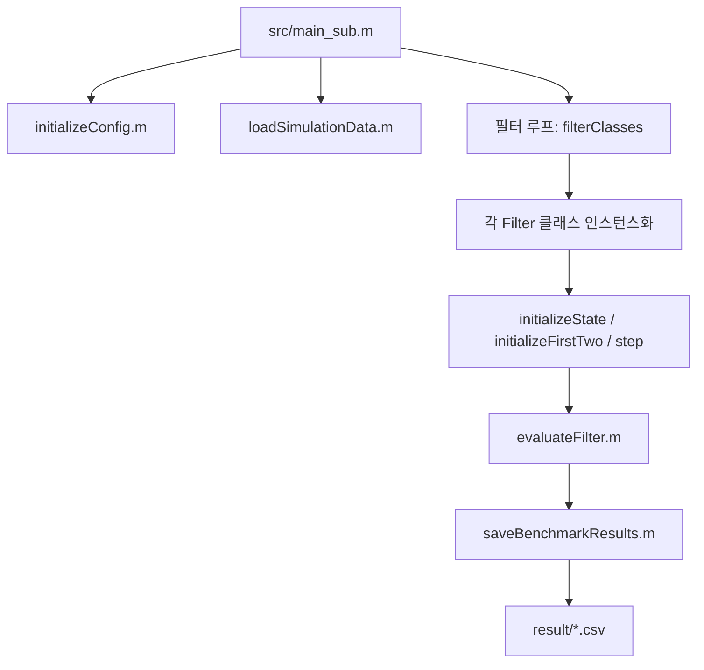

# localization-filters-2d 아키텍처 구조도

## 1) 프로젝트 구조 (코드 기반)

```text
localization-filters-2d/
├─ src/
│  ├─ main_sub.m                         # 배치 벤치마크 엔트리 (N별 반복 실행)
│  ├─ optimizePerNoiseGrid.m             # Adaptive PF per-noise 하이퍼파라미터 탐색
│  ├─ dataGenerate.m                     # 시뮬레이션 데이터 생성 (cv/imm 분기)
│  ├─ Filters/
│  │  ├─ Baseline.m                      # LLS 기반 baseline 추정
│  │  ├─ PF.m                            # PF 계열 기반 구현(공통 로직 포함)
│  │  ├─ NonlinearParticleFilter.m       # 비선형 PF
│  │  ├─ EKFParticleFilter.m             # EKF 결합 PF
│  │  ├─ AdaptiveParticleFilter.m        # 적응형 PF
│  │  ├─ RDiagPriorEditAdaptiveParticleFilter.m
│  │  └─ RougheningPriorEditingParticleFilter.m
│  ├─ archives/
│  │  ├─ a_Filters/
│  │  │  ├─ BeliefQShrinkAdaptiveParticleFilter.m   # 보관(활성 비교 제외)
│  │  │  └─ BeliefRougheningAdaptiveParticleFilter.m # 보관(활성 비교 제외)
│  ├─ utils/
│  │  ├─ initializeConfig.m              # 공통 설정/상수/경로/노이즈 레벨
│  │  ├─ runFilter.m                     # 필터 팩토리 + 노이즈 레벨 병렬 실행 파이프라인
│  │  ├─ loadSimulationData.m            # HDF5 데이터 로딩
│  │  ├─ evaluateFilter.m                # APE/RMSE 등 성능 평가
│  │  ├─ plotMetricComparison.m          # 메트릭 시각화
│  │  ├─ getBestParams.m                 # Adaptive PF 최적 파라미터 조회
│  │  └─ saveBenchmarkResults.m          # 결과 CSV 저장 (APE + runtime 행 삽입)
│  └─ archives/                          # 과거 코드(현행 파이프라인 외)
├─ data/
│  ├─ simulation_data.h5                 # CV 시나리오 데이터
│  └─ simulation_data_imm.h5             # IMM 시나리오 데이터
├─ result/                               # 벤치마크 결과 출력
├─ pytorch/                              # 별도 딥러닝 실험(주 파이프라인과 분리)
├─ README.md
└─ .github/copilot-instructions.md
```

## 2) 실행/평가 데이터 플로우



## 3) 모듈별 핵심 역할

- **`main_sub.m`**
  - 벤치마크 최상위 오케스트레이션.
  - `particleCounts`(예: 10~500)별 반복 실행.
  - motion model(`cv`/`imm`)에 따라 HDF5 파일 선택.
  - 필터별 runtime/metric 집계 후 결과 저장.

- **`utils/initializeConfig.m`**
  - 실험 공통 설정의 단일 진입점.
  - 노이즈 레벨 순서(`noiseVariance`)와 모델 파라미터를 통일.
  - 비교 실험의 재현성/일관성 보장.

- **`utils/runFilter.m` (공용 실행 파이프라인)**
  - 필터 팩토리(`localCreateFilter`)로 클래스 디스패치.
  - 노이즈 레벨 단위 병렬 실행(`parfor`)을 담당.
  - 신규 필터 추가 시 반드시 등록해야 하는 핵심 지점.

- **`Filters/*`**
  - 동일 인터페이스 기반 알고리즘 모듈:
    - `initializeState(numPoints)`
    - `initializeFirstTwo(state, iterIdx)`
    - `step(state, iterIdx, pointIdx)`
  - `Baseline`: LLS 기반 기준선.
  - `Nonlinear/EKF/Adaptive*`: 비선형/적응형 PF 변형군.

- **`utils/loadSimulationData.m`**
  - `data/simulation_data*.h5`에서 실험 텐서 로딩.
  - 평가 코드가 기대하는 shape 계약 유지에 중요.

- **`utils/evaluateFilter.m`, `plotMetricComparison.m`**
  - APE/RMSE 및 시각화 담당.
  - 메트릭 정의 변경 없이 결과 비교 가능하도록 분리.

- **`utils/getBestParams.m`**
  - Adaptive PF 계열의 per-noise 튜닝 파라미터 조회.
  - 공정 비교를 위한 하이퍼파라미터 표준화 지점.

- **`utils/saveBenchmarkResults.m`**
  - 파티클 수 단위 결과 파일 저장.
  - APE 표 + runtime 행 병합 출력.
  - 파일명에 motion model prefix 반영(`cv_`, `imm_`).

- **`dataGenerate.m`**
  - 실험 데이터 생성(필요 시).
  - `config.motionModel`에 따라 `dataGenerateIMM` 분기.

## 4) 설계 포인트 (비교 실험 관점)

1. **재현성**
   - 실험 시작 전 `rng(42, 'twister')` 고정.

2. **정합성**
   - 노이즈 인덱스와 `config.noiseVariance` 순서 일치 필수.
   - 추정 위치 텐서 shape 계약 유지: `(2, numPoints, numIterations, numNoise)`.

3. **확장성**
   - 신규 필터는 `src/Filters/`에 추가 후 `runFilter` 팩토리에 등록.
   - per-noise 튜닝 필요 시 `getBestParams` 유사 helper를 별도 추가.

4. **병렬 안정성**
   - `parfor` 환경에서 공유 mutable state 금지.
   - 필터 내부 상태는 반복/워커 지역 상태로 유지.

## 5) 현재 코드 기준 주요 경계선

- **주 파이프라인**: MATLAB `src/` 중심.
- **보조 실험 영역**: `pytorch/`, `archives/` (현행 벤치마크와 분리).
- **결과 산출물**: `result/` CSV 중심, README 표는 재실험 후 갱신.